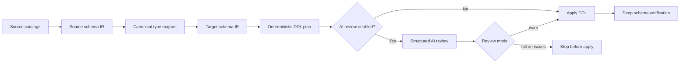

# Epic: Deterministic Schema DDL Generation

## Summary

SMT should stop using an AI model as the primary author of executable schema DDL. The new architecture should introspect the source schema deterministically, map source data types through a canonical type system, generate target DDL deterministically, and optionally ask an AI reviewer to inspect the generated DDL before it is applied.

The AI remains useful, but its role changes from "create the migration" to "review the migration plan." A schema migration should be able to run without AI and produce the same DDL for the same source schema, target dialect, and SMT version.

## Implementation Status

Branch `deterministic-ddl-epic` implements the first production vertical slice:

- PostgreSQL-target `smt create` can run with no AI provider configured.
- MSSQL to PostgreSQL table, primary-key, index, foreign-key, and check DDL is rendered deterministically.
- Optional AI review is separated from DDL generation and is disabled by default.
- Deterministic DDL artifacts and source schema JSON are written under the run directory.
- PostgreSQL-target `smt sync` can render schema-diff plans deterministically.
- SO2010 MSSQL to PostgreSQL passes deep no-repair verification with AI review disabled.

Remaining expansion work is primarily broader dialect coverage and richer IR metadata, not the core no-AI PostgreSQL path.

## Core Principle: AI Review Is Optional

Deterministic schema migration must be the default and must not require LM Studio, OpenAI-compatible APIs, or any other AI provider. AI review is an optional pre-apply check for users who want another layer of inspection.

When AI review is disabled, SMT should still:

- Introspect the source schema.
- Map source types deterministically.
- Generate target DDL.
- Apply the DDL.
- Produce schema artifacts.
- Run deep verification.

When AI review is enabled, it can warn or stop before apply based on configuration, but it should not become part of the correctness contract for the deterministic generator.

## Background

The current SMT flow is model-sensitive because it asks the configured AI model to generate target DDL. A second AI can optionally review the first AI's output, but that still leaves correctness dependent on generated text and retry behavior.

Recent SO2010 MSSQL to PostgreSQL tests showed the risk clearly:

- `google/gemma-4-e4b` completed after context tuning, but omitted a primary key on `PostLinks.Id` before manual repair.
- `google/gemma-4-12b-qat` stalled while generating the first table DDL.
- `openai/gpt-oss-20b` completed and passed deep no-repair schema verification, but the run still depended on AI-authored DDL.

UVG should be treated as the reference model for SMT's deterministic DDL architecture. SMT does not need to copy UVG's Rust implementation directly, but the Go design should deliberately mirror UVG's pipeline and separation of concerns:

- `src/schema.rs` defines a dialect-neutral introspected schema model.
- `src/introspect/*/columns.rs` starts from `information_schema` and enriches with dialect catalogs such as SQL Server `sys.*` and PostgreSQL `pg_catalog`.
- `src/ddl_typemap/mod.rs` maps dialect-specific types to a canonical type enum and then to target DDL types.
- `src/codegen/ddl/*` renders deterministic `CREATE TABLE`, column, constraint, and index DDL.
- `docs/design.md` describes the schema IR, canonical DDL type translation, and deterministic schema diff/codegen approach.

SMT should borrow these ideas while fitting its Go codebase and existing CLI/config model.

## UVG Reference Model

Use UVG as the architectural model for deterministic DDL generation:

1. Introspect into a dialect-neutral schema IR.
2. Normalize source types into canonical DDL types.
3. Map canonical types into target dialect DDL types.
4. Render DDL from structured metadata instead of free-form generated text.
5. Keep schema diffing/planning separate from DDL rendering.
6. Preserve warnings for approximate or lossy mappings as first-class data.

Relevant UVG source areas:

- `/home/johnd/repos/uvg/src/schema.rs`
- `/home/johnd/repos/uvg/src/introspect/`
- `/home/johnd/repos/uvg/src/ddl_typemap/`
- `/home/johnd/repos/uvg/src/codegen/ddl/`
- `/home/johnd/repos/uvg/src/codegen/ddl_diff.rs`

SMT should translate these ideas into Go packages rather than introducing a dependency on UVG. The expected result is the same architecture pattern: catalog-backed schema IR, canonical type mapping, deterministic DDL plans, optional review, and independent verification.

## Goals

- Introspect source schema from `information_schema` as the portable baseline.
- Enrich source schema metadata with dialect catalogs where `information_schema` is incomplete.
- Build a complete internal schema IR before generating target DDL.
- Map source types deterministically through canonical types.
- Generate target DDL deterministically for tables, columns, constraints, indexes, identity, defaults, checks, and foreign keys.
- Treat unknown or lossy mappings explicitly through policy and warnings.
- Use AI only as an optional reviewer of deterministic DDL before applying it.
- Make the no-AI path first-class, documented, and tested.
- Make the reviewer return structured output that can be logged, failed, or surfaced to the user.
- Keep deep no-repair verification as the acceptance standard.

## Non-Goals

- Do not make AI patching the default path.
- Do not require AI for ordinary schema migration.
- Do not require AI review for ordinary schema migration.
- Do not make AI review part of the generator's correctness contract.
- Do not use row counts or table counts as the main quality signal.
- Do not rewrite unrelated data-copy behavior as part of this epic.
- Do not require perfect semantic translation of every engine-specific default or check predicate in the first milestone.

## Current SMT Flow To Change

Current schema creation is centered on AI-generated table DDL:

- `internal/orchestrator/orchestrator.go` wires the primary AI mapper and optional verifier mapper.
- `internal/driver/ai_typemapper.go` exposes `GenerateTableDDL` and the AI cache key.
- `internal/driver/postgres/writer.go` asks AI to generate table DDL, optionally sends that output to another AI for verification, and executes the resulting SQL.
- `internal/config/config.go` exposes `ai_verify` and `ai_verifier_model`, currently meaning "second AI reviews first AI output."

That flow should be replaced by deterministic generation plus optional AI review.

## Proposed Architecture



The target state is:

1. Source introspection produces a complete schema IR.
2. Type mapping produces target type decisions and warnings.
3. DDL generation is pure and deterministic.
4. AI review inspects the deterministic plan before apply.
5. Apply and verification operate on known DDL artifacts.

## Workstream 1: Schema IR

Create an internal schema model that is richer than the current table/column structs and can survive a full round trip from source introspection to target DDL.

The IR should include:

- Catalog, schema, and table names.
- Column ordinal, name, source type, normalized/canonical type, target type, nullability, default, computed expression, collation, comments, and generated/identity metadata.
- Numeric precision/scale, datetime precision, character length, byte length, and source-specific type names.
- Primary keys, unique constraints, foreign keys, check constraints, indexes, and index included columns where supported.
- Constraint and index names as source names plus normalized target names.
- Warnings for approximate, lossy, unsupported, or policy-driven decisions.

Suggested Go package shape:

- `internal/schema` for IR structs.
- `internal/introspect` for source-specific introspection.
- `internal/ddl` for target DDL planning and rendering.
- `internal/typemap` for canonical type mapping.

## Workstream 2: Catalog-Backed Introspection

Use `information_schema` as the common starting point, then add source-specific catalog queries for details it does not expose reliably.

For SQL Server, collect:

- `INFORMATION_SCHEMA.TABLES` and `INFORMATION_SCHEMA.COLUMNS`.
- `sys.columns` for exact type IDs, max length, computed status, generated metadata, and collation.
- `sys.types` for user-defined and alias types.
- `sys.identity_columns` for seed, increment, and identity behavior.
- `sys.default_constraints` for default definitions.
- `sys.computed_columns` for computed column definitions.
- `sys.key_constraints`, `sys.indexes`, `sys.index_columns`, and `sys.foreign_keys`.
- `sys.check_constraints`.
- `sys.extended_properties` for comments where available.

For PostgreSQL source support, collect:

- `information_schema.columns`.
- `pg_catalog` type names and modifiers.
- identity and serial metadata through `pg_sequence`, `pg_get_serial_sequence`, and `pg_attrdef`.
- constraints and indexes through `pg_constraint`, `pg_index`, `pg_class`, and `pg_attribute`.

For MySQL source support, collect:

- `information_schema.COLUMNS`, including `COLUMN_TYPE` and `EXTRA`.
- key, constraint, index, generated-column, charset, and collation metadata from `information_schema`.

Acceptance criteria:

- SO2010 MSSQL introspection captures all tables, columns, nullability, defaults, identities, PKs, FKs, checks, and indexes needed for schema generation.
- Introspection tests can serialize the IR to stable JSON golden files.
- The same source schema produces identical IR across repeated runs.

## Workstream 3: Deterministic Type Mapping

Add a canonical type layer inspired by UVG's `CanonicalType` and `DdlType`.

Each mapping should have:

- Source dialect and source type metadata.
- Canonical type.
- Target dialect and target SQL type.
- Lossiness flag.
- Warning or rationale when the mapping is approximate.
- Policy result for unknown or unsupported types.

Example canonical categories:

- Integer, BigInteger, SmallInteger, TinyInteger.
- Decimal, Money, Float, Real.
- Boolean.
- FixedString, VarString, Text.
- FixedBinary, VarBinary, BinaryLargeObject.
- Date, Time, Timestamp, TimestampWithTimeZone.
- UUID.
- JSON.
- XML.
- Spatial.
- RowVersion.
- Unknown.

Default policy should be conservative:

- `unknown_type_policy: fail` by default.
- `unknown_type_policy: warn` for exploratory runs.
- `unknown_type_policy: text_fallback` only when the user explicitly chooses lossy fallback.

Acceptance criteria:

- Unit tests cover all currently supported source-to-target type pairs.
- MSSQL to PostgreSQL mappings used by SO2010 are deterministic and warning-free unless genuinely lossy.
- Unknown source types cannot silently become `text`.
- Mapping behavior is versioned so cached output can be invalidated when mapping logic changes.

## Workstream 4: Deterministic DDL Planner And Renderer

Build a DDL plan from the target schema IR before executing anything.

The plan should include ordered statements for:

- Schemas.
- Tables and columns.
- Primary keys and unique constraints.
- Foreign keys.
- Check constraints.
- Indexes.
- Comments, if supported.
- Post-create statements needed for cyclic dependencies.

Renderer requirements:

- Stable statement ordering.
- Stable identifier quoting.
- Stable constraint/index naming.
- Target-dialect-specific rendering.
- Idempotent optional mode where practical.
- Separation between render, review, apply, and verify.

For PostgreSQL target DDL:

- Prefer `GENERATED BY DEFAULT AS IDENTITY` or `GENERATED ALWAYS AS IDENTITY` over legacy `SERIAL`, unless compatibility mode says otherwise.
- Emit numeric precision/scale and datetime precision where relevant.
- Preserve explicit nullability.
- Translate defaults only when a deterministic rule exists.
- Flag source defaults/checks that are not safely portable.

Acceptance criteria:

- Running the same migration twice against the same source produces byte-identical DDL plans.
- DDL plans are saved as artifacts for review and debugging.
- SO2010 MSSQL to PostgreSQL creates all expected schema objects without AI generation.

## Workstream 5: AI Review Redesign

The current second-AI workflow should be removed or modified because there should no longer be "first AI output" to review.

New model:

- Deterministic SMT code creates the DDL plan.
- AI review is disabled by default.
- Optional AI reviewer inspects the plan and source/target schema summaries only when enabled.
- The reviewer returns structured JSON.
- The reviewer does not rewrite executable DDL by default.
- SMT either logs warnings, fails before apply, or allows apply based on review mode.

Suggested config:

```yaml
schema_generation:
  mode: deterministic
  unknown_type_policy: fail

ai_review:
  enabled: false
  model: openai/gpt-oss-20b
  mode: warn
  scope: plan
  allow_patch_suggestions: false
```

Backward compatibility:

- Continue accepting `ai_verify` temporarily as a deprecated alias for `ai_review.enabled`.
- Continue accepting `ai_verifier_model` temporarily as a deprecated alias for `ai_review.model`.
- Emit a deprecation warning when old fields are used.
- Remove the retry loop where verifier feedback is fed back into AI DDL generation.

Reviewer output contract:

```json
{
  "verdict": "pass",
  "issues": [],
  "warnings": [],
  "confidence": "medium",
  "summary": "No blocking issues found."
}
```

Possible verdicts:

- `pass`: no blocking issues.
- `warn`: concerns exist, but apply can continue in warn mode.
- `fail`: stop before apply unless the user overrides.

The reviewer prompt should ask for:

- Missing constraints.
- Unsafe type mappings.
- Suspicious nullability changes.
- Identity/default/check translation risks.
- Name collisions.
- Unsupported dialect features.
- DDL that is likely invalid for the target engine.

Acceptance criteria:

- AI review can be disabled and the migration still runs.
- CI includes at least one deterministic schema migration test with AI review disabled.
- AI review never has authority to silently change executable DDL.
- In `fail` mode, a reviewer `fail` verdict stops before apply.
- In `warn` mode, warnings are recorded in the migration report.
- Existing configs with `ai_verify` still work during the transition but show deprecation guidance.

## Workstream 6: Schema Diff And Sync

SMT's sync/update path should use deterministic schema diffing instead of AI-authored ALTER statements.

Diff inputs:

- Source schema IR.
- Existing target schema IR.
- Desired target schema IR.
- Type mapper version.
- User policies for destructive changes.

Diff outputs:

- Additive changes.
- Modified columns.
- Missing constraints.
- Extra target objects.
- Potential destructive changes requiring explicit confirmation.
- Unsupported changes that need manual handling.

Acceptance criteria:

- Sync can produce a dry-run plan without applying changes.
- Destructive changes are never applied by default.
- AI review can inspect the diff plan but cannot silently rewrite it.

## Workstream 7: Cache And Artifact Changes

The current AI DDL cache is not valid for deterministic generation.

New artifacts should include:

- Source schema IR JSON.
- Desired target schema IR JSON.
- Type mapping report.
- DDL plan SQL.
- AI review JSON, if enabled.
- Apply log.
- Verification report.

Cache keys should include:

- Source schema fingerprint.
- Target dialect.
- SMT version.
- Type mapper version.
- DDL renderer version.
- Relevant policy settings.

Acceptance criteria:

- Old AI-generated DDL cache entries are ignored by deterministic mode.
- Cache invalidation happens automatically when mapper or renderer versions change.
- Users can inspect the exact SQL that was reviewed and applied.

## Workstream 8: Verification

Verification should remain independent of AI and independent of the generator.

Required verification layers:

- Unit tests for type mapping.
- Golden tests for DDL rendering.
- Introspection fixture tests.
- End-to-end SO2010 MSSQL to PostgreSQL no-repair verification.
- Regression tests for identity, defaults, PKs, FKs, checks, and indexes.
- Mocked AI reviewer tests for pass, warn, fail, invalid JSON, timeout, and retry behavior.

Deep verification should compare:

- Table presence.
- Column presence and order where meaningful.
- Target data types.
- Length, precision, and scale.
- Nullability.
- Identity behavior.
- Defaults.
- Primary keys.
- Unique constraints.
- Foreign keys.
- Check constraints.
- Indexes.

Acceptance criteria:

- SO2010 MSSQL to PostgreSQL passes deep verification with zero manual repairs.
- Gemma-class model variance cannot remove constraints because AI does not author DDL.
- Tests fail if a primary key like `PostLinks.Id` is omitted.
- Verification reports distinguish errors from warnings and lossy accepted mappings.

## Workstream 9: CLI, Config, And Documentation

Update user-facing behavior to make deterministic generation the default.

CLI/config work:

- Add deterministic schema generation config.
- Add AI review config.
- Add unknown/lossy mapping policy config.
- Add dry-run DDL output command or flag.
- Add artifact directory controls.
- Add deprecation warnings for `ai_verify` and `ai_verifier_model`.
- Document recommended local AI reviewer models separately from deterministic generation.

Documentation updates:

- Explain that schema DDL no longer requires AI.
- Explain when AI review helps.
- Explain how to run no-AI, same-model review, and separate-reviewer-model modes.
- Document source-specific mapping limitations.
- Document how to read type mapping warnings.

Acceptance criteria:

- Existing users can migrate configs without breaking immediately.
- New users can run deterministic schema migration without configuring LM Studio.
- Docs clearly state that AI review is optional.

## Workstream 10: Rollout Plan

Milestone 1: Design and IR

- Add schema IR structs.
- Add source introspection adapters.
- Add stable JSON serialization for IR snapshots.
- Add fixture/golden tests.

Milestone 2: Type Mapping

- Add canonical type mapper.
- Add source-to-canonical and canonical-to-target mapping tests.
- Add warning and failure policies.
- Validate SO2010 type coverage.

Milestone 3: PostgreSQL DDL Generation

- Add deterministic PostgreSQL renderer.
- Generate full create-schema plans.
- Save SQL artifacts.
- Run SO2010 no-AI migration.

Milestone 4: AI Review

- Replace AI DDL generation path with optional review path.
- Add structured reviewer prompt and parser.
- Add review modes.
- Deprecate old verifier config.

Milestone 5: Sync/Diff

- Add deterministic target introspection.
- Add schema diff planner.
- Add dry-run sync output.
- Gate destructive changes.

Milestone 6: Hardening

- Add broader live fixtures.
- Add docs and examples.
- Remove old AI-generation fallback unless explicitly retained behind an experimental flag.

## Open Questions

- Should SMT keep an experimental AI DDL generator behind a separate flag, or remove it completely after deterministic generation is stable?
- Should the first deterministic release support only MSSQL to PostgreSQL, then expand other dialect pairs?
- Should AI review inspect the entire plan before apply, table-level chunks, or both?
- Should `SERIAL` ever be emitted for PostgreSQL targets, or should identity always be the default?
- How much of check/default expression translation should be deterministic in the first release versus flagged for manual review?
- Should the reviewer be allowed to provide non-executable patch suggestions for humans, even though SMT will not apply them automatically?

## Definition Of Done

This epic is complete when:

- SMT can migrate the SO2010 schema from MSSQL to PostgreSQL without AI DDL generation.
- SMT can complete the deterministic schema path with AI review disabled.
- The deterministic run passes deep no-repair schema verification.
- Repeated runs produce the same DDL plan for the same inputs.
- AI review is optional and structured.
- The old "second AI reviews first AI output" flow is deprecated or removed.
- Unknown and lossy mappings are explicit and policy-controlled.
- Documentation explains the new architecture, config, and migration path.
